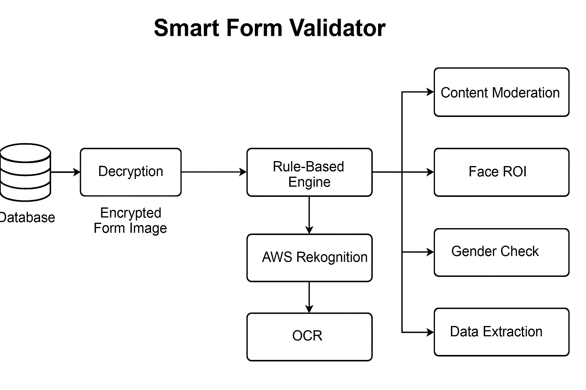

# 🧾 Smart Form Validator

An intelligent backend system that automatically validates scanned application forms stored in a secure database. The system detects inappropriate or spoofed images, validates gender identity, and extracts form fields using OCR.

---

## 📌 Overview

**Smart Form Validator** is a backend-only application that performs scheduled validation on encrypted image data stored in a database. The system automatically decrypts, processes, and validates each form image through a rule-based pipeline.

> ⚠️ This repository contains only the README and architectural flow for understanding the system design. No datasets, models, or code are included due to company restrictions.

---

## 🔁 Key Features

- 🗂️ **Automated DB Polling** – Regularly checks the database for new encrypted form images
- 🔐 **Decryption Layer** – Securely decrypts each image before processing
- 🧠 **Face ROI Detection** – Extracts the face region using OpenCV for downstream validation
- 🛡️ **Content Moderation** – Detects obscenities, nudity, celebrity spoofing, or masks using AWS Rekognition
- 🚻 **Gender Validation** – Predicts gender from image and compares with form entry
- 🧾 **Text Extraction** – Extracts handwritten/typed fields using AWS Textract and Pytesseract
- 🧪 **Validation Engine** – Flags mismatches or failed checks and logs structured results

---

## 🧠 Architecture



---

## 🛠 Tech Stack

| Component          | Tool/Service                 |
|-------------------|------------------------------|
| Language           | Python                       |
| Image Processing   | OpenCV, Pillow               |
| OCR                | Pytesseract, AWS Textract    |
| Content Analysis   | AWS Rekognition              |
| API Framework      | Flask                        |
| Database           | MySQL                        |

---

## 🎯 Objective

The goal of the **Smart Form Validator** is to automate the verification of scanned or uploaded application forms using computer vision and AI-based validation techniques. It is designed for backend-only execution to streamline data validation, eliminate manual review bottlenecks, and ensure the authenticity of user-submitted documents.

---

## 🔄 Process & Flow

This backend service operates in a fully automated manner, capable of running on a schedule or processing all entries available at a specific time. Below is the generalized flow of the application:

1. **🔐 Encrypted Image Fetching**  
   Form images are fetched from a secure database where they are stored in encrypted form.

2. **🔓 Image Decryption**  
   Each image is decrypted securely before further processing.

3. **🧠 Face ROI & Content Moderation**  
   The photo region is detected and validated using AWS Rekognition to ensure:
   - A real, unobstructed face is visible
   - No inappropriate, spoofed, or misleading content is present

4. **🚻 Gender Validation**  
   Gender predicted from the image is compared with the gender field filled in the form. Mismatches are flagged for review.

5. **📝 Field Extraction via OCR**  
   - **Typed fields** (like Name, App ID) are extracted using **Pytesseract**
   - **Handwritten fields** (like address, comments) are extracted using **AWS Textract**

6. **📦 Result Generation**  
   Final results are compiled in a structured JSON format containing:
   - Extracted fields
   - Moderation flags
   - Gender validation result
   - Alerts if any checks fail

7. **🕒 Execution Mode**  
   - The system runs at regular intervals (default: scheduled polling)
   - It can also run once manually to process all pending images up to that moment

---

## 📥 Example Output

```json
{
  "application_id": "FORM_20250401_0012",
  "status": "Alert",
  "face_clear": true,
  "gender_match": false,
  "moderation_passed": true,
  "extracted_fields": {
    "name": "Ravi Kumar",
    "dob": "1992-07-11",
    "gender": "Male"
  }
}
```

---

## 🧾 Use Cases

- ✅ **Government Forms**  
  Automating the validation of scanned applications for IDs, licenses, permits, etc.

- ✅ **Corporate Onboarding**  
  Validating employee documents and verifying consistency of submitted forms.

- ✅ **Banking & Insurance**  
  Ensuring authenticity of KYC forms and cross-checking with uploaded photographs.

- ✅ **Educational Institutions**  
  Processing student admission forms for identity, eligibility, and completeness.

---

## 🔒 Disclaimer

This repository demonstrates a professional-grade application structure and processing pipeline.  
It **does not include** proprietary data, production-trained models, or confidential credentials. 
You are free to adapt the structure, pipeline logic, and modular components for educational, testing, or private deployments.

---

## 👨‍💻 Author

**Goutham Sidhik**  
AI/ML Engineer | Computer Vision & GenAI Developer  
[LinkedIn](https://www.linkedin.com/in/goutham-sidhik-amuluru-50231b163/)

---

